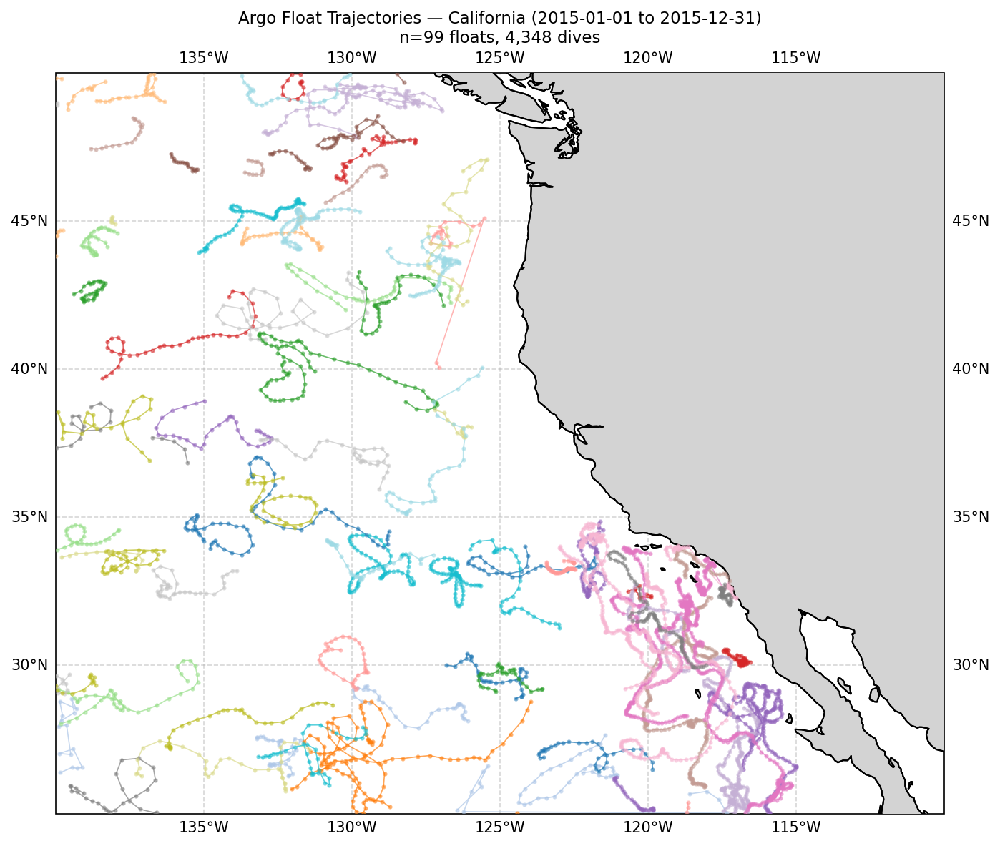
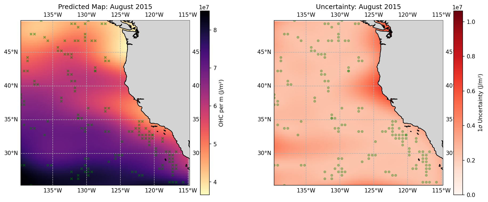
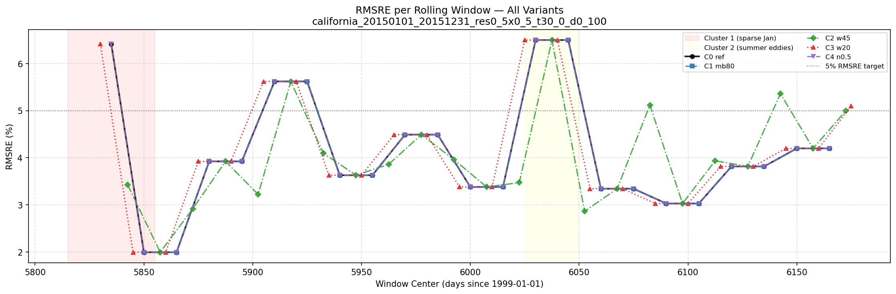
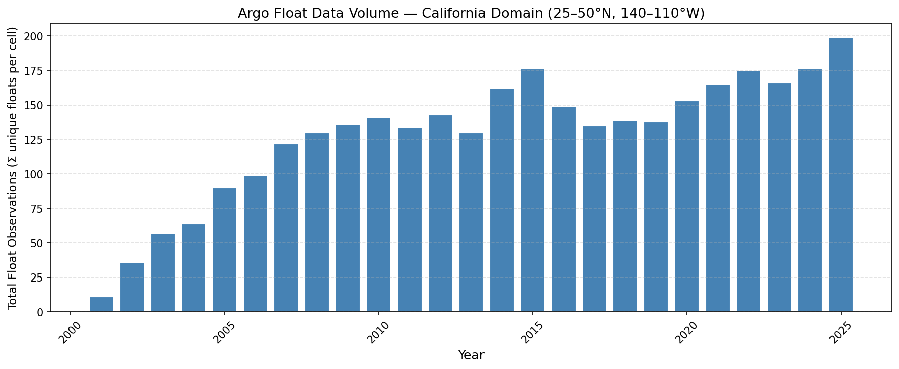

EBUS-Refugia-Heat-Analysis
The "Vertical Audit" of the California Current System
Research Question: Is the California Current System (CCS) acting as a true thermal refugium, or is the "upwelling mask" hiding significant subsurface warming in the source waters?

While most climate resilience studies rely on Satellite SST (Skin Temperature), this project conducts a Vertical Audit using the Argo float array. By strictly separating the water column into physically distinct thermodynamic layers (Response, Source, and Background), we test for "Stealth Warming"—a decoupling event where the upwelling source waters warm independently of the surface signal.

Key Methodology:

Sparsity Quantification: Rigorous evaluation of the "Void Ratio" in observational arrays.

Probabilistic Modeling: Application of advanced spatial interpolation techniques to generate continuous subsurface heat fields with explicit uncertainty quantification.

Trend Decoupling: Statistical comparison of surface vs. subsurface warming rates to detect "Refugia Failure."

Climate Attribution: Isolation of ENSO-driven variability from secular warming trends.

This repository contains the data pipeline, statistical modeling framework, and validation suite for quantifying the resilience of Eastern Boundary Upwelling Systems.

---

## Example Outputs

**Argo Float Tracks — California Current System (2015)**

**Kriged Ocean Heat Content Map (Skin Layer, August 2015)**

**Cross-Validation: RMSRE Overlay**

**Float Census — Annual Totals (1999–2025)**

